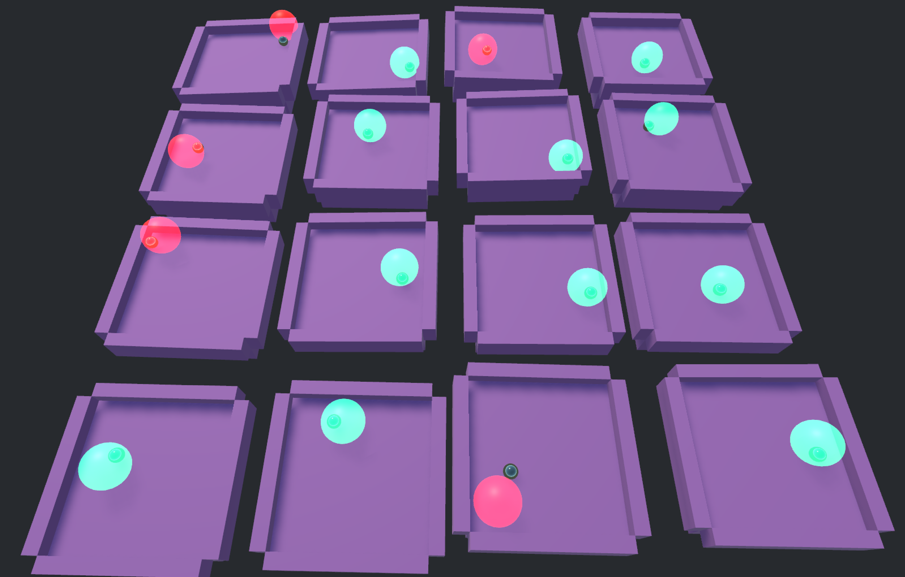

## Preview


## pytorch model path
```
unity_python\Assets\StreamingAssets\python\pytorch_models/*.pth
```

# guide-unity_python_scripting for Deep Reinforcement Learning
- Execute python on unity
- TCPIP between unity and python
- Deep Reinforcement Learning(DRL) without Unity ML-Agent

## Python install 
- python version: 3.9.12(64-bit)
- (option) Do Not Add Python 3.9 to path

### python directory
```
C:\Users\[username]\AppData\Local\Programs\Python\Python39/python.exe
```
## vscode linting
File-Open Folder

change interpreter to venv


## you should install venv manually

```
C:\Users\[username]\AppData\Local\Programs\Python\Python39\python.exe -m venv .venv
```

### venv directory
```
Assets/StreamingAssets/python/.venv/
```

#### why in /StreamingAssets/?
.venv must exist in build path
StreamingAssets folder can align both editor and build environment.

### active.bat modify(only when move venv folder)
In my experience, It runs well without activate

but for whom need it..
```
set VIRTUAL_ENV=[Absolutepath]\.venv
```
=>
```
set VIRTUAL_ENV=%cd%\..\..\.venv
```
## module

### numpy
install numpy for just module import test
### Pytorch
[PyTorch](https://pytorch.org/)

#### cuda install
[CUDA Toolkit 12.1 Downloads | NVIDIA Developer](https://developer.nvidia.com/cuda-12-1-0-download-archive?target_os=Windows&target_arch=x86_64&target_version=11&target_type=exe_local)

**Cuda version must be matched with pytorch cude version(specified on pytorch.org)**
In this project, I installed CUDA 12.1
#### pytorch install
```
[venv dir]\.venv\Scripts\python.exe -m pip install torch torchvision torchaudio --index-url https://download.pytorch.org/whl/cu121

or

cd to parent of ./venv and
.\.venv\Scripts\python.exe -m pip install torch torchvision torchaudio --index-url https://download.pytorch.org/whl/cu121
```

## Unity

### Scene: PythonExecuteScene.unity

#### script
[C# script](unity_python/Assets/Scripts/PythonExecute.cs)

[python script](unity_python/Assets/StreamingAssets/python/python_scripts/test.py)


#### result


# Ball balancing project

input:

ball position (x,y,z), ball speed (x,y,z), target position(x,y,z), current plate Euler angle (rx,rz), rotation speed(rad/s?)

3+3+3+2+1 = 12
```C#
PythonProcess.StandardInput.WriteLine($"{Vector3ToString(BallPosition)},{Vector3ToString(BallSpeed)},{PlateRX},{PlateRZ},{Vector3ToString(TargetPosition)},{PlateAngularSpeed}");

```

output:

5-Action (RX+, RX-, RZ+, RZ-, NOTHING)


## Version


### ballbalancing_model v5.1
DQN:
```python
class DQN(nn.Module):##v5.1
    def __init__(self, state_size, action_size):
        super(DQN, self).__init__()
        self.fc1 = nn.Linear(state_size, 64)
        self.fc2 = nn.Linear(64, 64)
        self.fc3 = nn.Linear(64, 64)
        self.relu = nn.ReLU()
        self.fc4 = nn.Linear(64, action_size)

    def forward(self, x):
        x = self.relu(self.fc1(x))
        x = self.relu(self.fc2(x))
        x = self.relu(self.fc3(x))
        return self.fc4(x)

```
#### ballbalancing_model_v5_1_231209.pth
- trained 1000 episodes
- 50~70%

##### reward:

**So far, the linear distance reward system has performed the best.**
```C#
Reward += (TargetThreshold-dist)/10f;
```

### ballbalancing_model v6
- Add guide wall(negative reward when collision)
- multi agent

- condition:
```python
self.optimizer = optim.Adam(self.net.parameters(), lr=0.001)
self.batch_size = 64
self.gamma = 0.99
```

```python
self.local_memory = ReplayMemory(10000)
self.eps_start = 0.99
self.eps_end = 0.05
self.eps_decay = 50
self.steps_done = 0
```
DQN:
```python
class DQN(nn.Module):##v6
    def __init__(self, state_size, action_size):
        super(DQN, self).__init__()
        self.fc1 = nn.Linear(state_size, 64)
        self.fc2 = nn.Linear(64, 64)
        self.fc3 = nn.Linear(64, 64)
        self.relu = nn.ReLU()
        self.fc4 = nn.Linear(64, action_size)

    def forward(self, x):
        x = self.relu(self.fc1(x))
        x = self.relu(self.fc2(x))
        x = self.relu(self.fc3(x))
        return self.fc4(x)
```

#### reward:

**So far, the linear distance reward system has performed the best.**
```C#
Reward += (TargetThreshold-dist)/10f;
```


#### Normalization

```C#
PlateRX = this.PlateRX/10f,
PlateRZ = this.PlateRZ/10f,
```