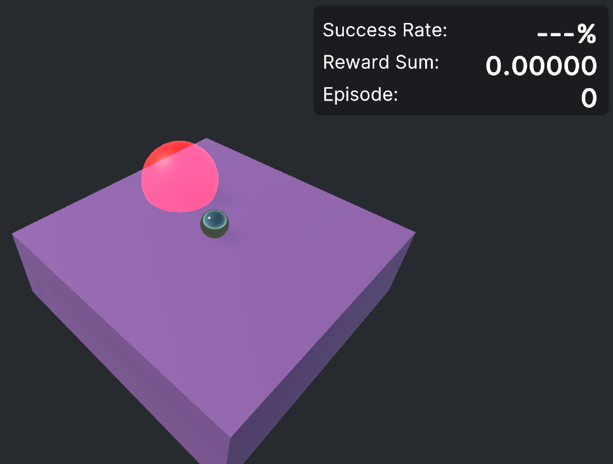

# guide-unity_python_scripting
Execute python on unity
## Python install 
- python version: 3.9.12(64-bit)
- (option) Do Not Add Python 3.9 to path

### python directory
```
C:\Users\[username]\AppData\Local\Programs\Python\Python39/python.exe
```
## vscode linting
File-Open Folder

change interpreter to venv


## you should install venv manually

```
C:\Users\[username]\AppData\Local\Programs\Python\Python39\python.exe -m venv .venv
```

### venv directory
```
Assets/StreamingAssets/python/.venv/
```

#### why in /StreamingAssets/?
.venv must exist in build path
StreamingAssets folder can align both editor and build environment.

### active.bat modify(only when move venv folder)

```
set VIRTUAL_ENV=[Absolutepath]\..\.venv
```
=>
```
set VIRTUAL_ENV=%cd%\..\.venv
```

## module

### numpy
install numpy for just module import test
### Pytorch
[PyTorch](https://pytorch.org/)

#### cuda install
[CUDA Toolkit 12.1 Downloads | NVIDIA Developer](https://developer.nvidia.com/cuda-12-1-0-download-archive?target_os=Windows&target_arch=x86_64&target_version=11&target_type=exe_local)

**Cuda version must be matched with pytorch cude version(specified on pytorch.org)**
In this project, I installed CUDA 12.1
#### pytorch install
```
[venv dir]\.venv\Scripts/python.exe -m pip install torch torchvision torchaudio --index-url https://download.pytorch.org/whl/cu121
```

## Unity

### Scene: PythonExecuteScene.unity

#### script
[C# script](unity_python/Assets/Scripts/PythonExecute.cs)

[python script](unity_python/Assets/StreamingAssets/python/python_scripts/test.py)


#### result


# Ball balancing project

input:

ball position (x,y,z), ball speed (x,y,z), target position(x,y,z), current plate Euler angle (rx,rz), rotation speed(rad/s?)

3+3+3+2+1 = 12
```C#
PythonProcess.StandardInput.WriteLine($"{Vector3ToString(BallPosition)},{Vector3ToString(BallSpeed)},{PlateRX},{PlateRZ},{Vector3ToString(TargetPosition)},{PlateAngularSpeed}");

```

output:

4-Action (RX+, RX-, RZ+, RZ-)

## Photo


## pytorch model path
```
unity_python\Assets\StreamingAssets\python\pytorch_models/ballbalancing_model.pth
```